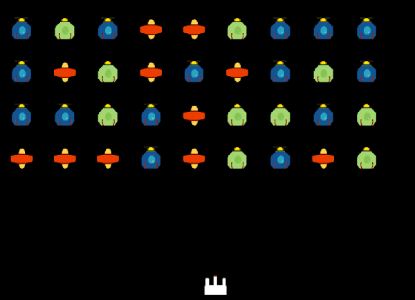
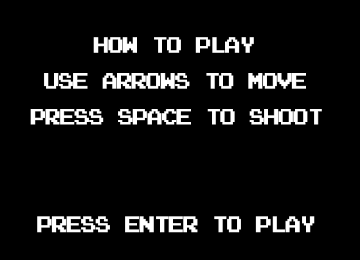
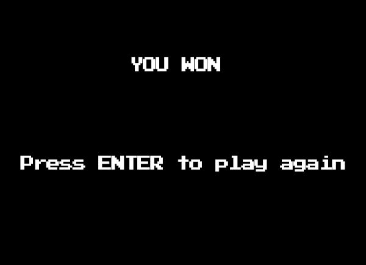
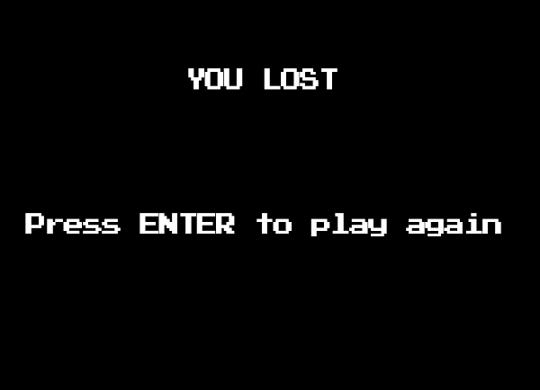

# Space Invaders

This is a Space Invaders type of game using the MelonJS boilerplate. The boilerplate and game assets are all provided in the tutorial on the [MelonJS](http://melonjs.org/) website.

Click [HERE](http://melonjs.github.io/tutorial-space-invaders/) for the Space Invaders tutorial.

This is the output when completed:

Additional Challenges are also provided in the tutorial.
Here are some screenshots.

Challenge 1:

Challenge 2: (In-Progress)

Challenge 3: (In-Progress)
